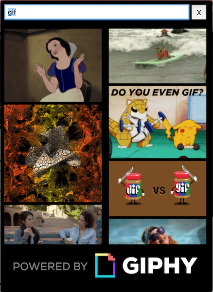

# GifBar

**GifBar is a quick gif searching app that lives in your menubar.**

Gifbar is built on React, Webpack and Electron.



## Setup

Giphy requires an API key. Get yours [here](https://developers.giphy.com/).

Once you have one, edit the root file `env.empty.json` and save it as `env.json`. (The build script will move it to the correct location)

## Installation

```bash
npm install

# To generate build directory (required to run app)
npm run build

# To watch for changes (for use when developing)
npm run watch

# Start the Electron app
npm run electron

# Build a release
npm run release
```

## Notes

Pronunciation: Much like how the creator of the file format has told us that it's pronounced, 'jif'; you pronounce the name of this application, `jif-bar`.

Or: Pronounce it with a hard 'G' like 'goat' or 'golf'. Do whatever you like and don't let people tell you how to live.

[](https://greenkeeper.io/)

In-app icons courtesy of [flaticons.net/](http://flaticons.net/)